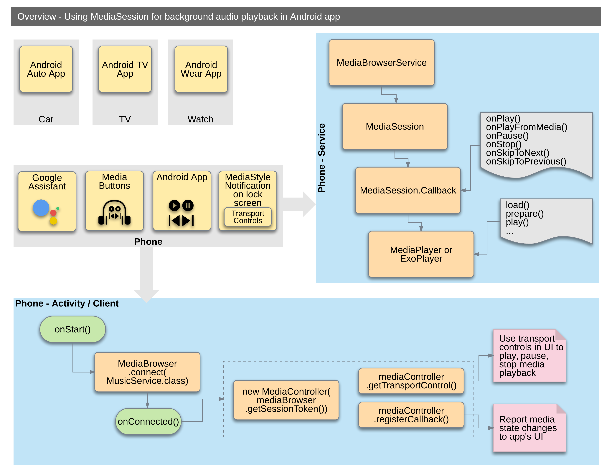
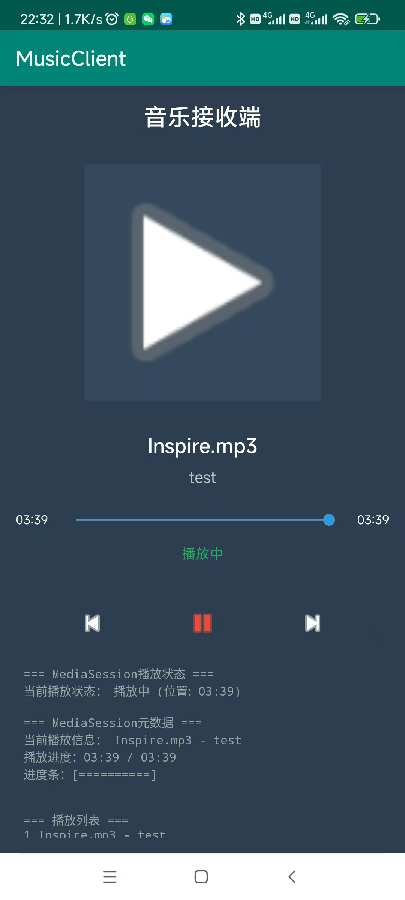
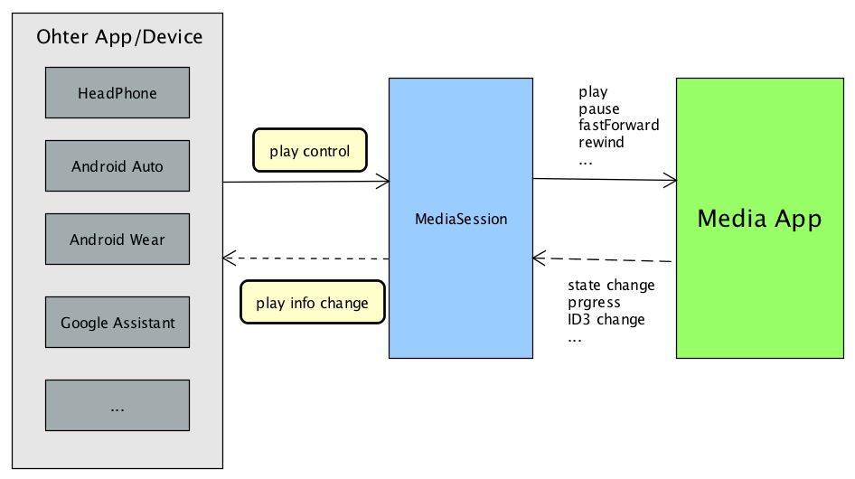

# MediaSession音乐播放器

一个基于Android MediaSession架构的跨应用音乐播放器，展示了MediaSession与MediaBrowser的完整实现，支持实时进度同步和跨应用音乐控制。

## 🎵 项目概述

本项目实现了两个独立的应用：
- **MusicPlayer** - 音乐播放器（播放端）
- **MusicClient** - 音乐接收器（控制端）

通过MediaSession框架实现了完整的音乐播放控制、进度同步和跨应用通信。

## ✨ 主要功能

### MusicPlayer（音乐播放器）
- 🎵 完整的音乐播放功能
- ⏮ 上一曲/下一曲控制
- ⏹️ 实时进度条（每秒更新）
- 🎮 播放/暂停控制
- 📂 自动扫描下载目录和系统音乐库
- 🎯 支持多种音乐格式（mp3、wav、flac、aac等）
- 📊 实时显示歌曲信息、播放时长、当前进度
- 🔄 MediaSession服务，支持外部应用连接

### MusicClient（音乐接收器）
- 🎨 现代化音乐播放器界面
- 📊 实时同步显示播放状态
- ⏹️ 实时进度条，支持拖拽控制
- 🎮 完整的播放控制（播放/暂停/上一曲/下一曲）
- 📱 跨应用控制MusicPlayer
- 🔍 详细的MediaSession状态信息显示
- ⚡ 双向数据同步

## 🏗️ 技术架构

### 核心技术栈
- **MediaSessionCompat** - 媒体会话管理
- **MediaBrowserCompat** - 媒体浏览器
- **MediaControllerCompat** - 媒体控制器
- **MediaPlayer** - 底层播放引擎
- **MediaMetadataCompat** - 媒体元数据
- **PlaybackStateCompat** - 播放状态管理

### 架构设计


```
MusicPlayer (Service) ←→ MediaSession ←→ MediaBrowser ←→ MusicClient (Activity)
     ↓                        ↓                   ↓
MediaPlayer               TransportControls      UI更新
```

## 📱 界面展示

### MusicPlayer界面


MusicPlayer是音乐播放端，主要界面包括：
- 📋 **播放列表**（RecyclerView）- 显示扫描到的音乐文件
- 🎛️ **底部控制栏** - 固定在底部的播放控制区域
  - ⏱️ **实时进度条** - 每秒更新，支持拖拽调整播放位置
  - ⏮️ **控制按钮** - 上一曲/播放-暂停/下一曲按钮
  - 🎵 **歌曲信息显示** - 当前播放歌曲的标题和艺术家

### MusicClient界面


MusicClient是远程控制端，采用现代化音乐播放器设计：
- 🎨 **专辑封面显示区域** - 视觉焦点，显示专辑封面
- 📊 **歌曲信息** - 歌名、艺术家信息清晰展示
- ⏱️ **实时进度条** - 与MusicPlayer同步更新，支持拖拽控制
- 🎮 **播放状态指示** - 显示当前播放/暂停状态
- 🔘 **控制按钮** - 播放/暂停/上一曲/下一曲完整控制
- 📈 **调试信息区域** - 显示MediaSession连接状态和同步信息

## 🔄 通信机制

### MediaSession数据传输

**播放状态同步：**
```java
// MusicPlayer发送
mPlaybackState = new PlaybackStateCompat.Builder()
    .setState(PlaybackStateCompat.STATE_PLAYING, position, 1.0f, SystemClock.elapsedRealtime())
    .build();
mSession.setPlaybackState(mPlaybackState);

// MusicClient接收
@Override
public void onPlaybackStateChanged(PlaybackStateCompat state) {
    updatePlayerState(state);
}
```

**歌曲信息同步：**
```java
// MusicPlayer发送
MediaMetadataCompat metadata = new MediaMetadataCompat.Builder()
    .putString(MediaMetadataCompat.METADATA_KEY_TITLE, "歌曲名")
    .putString(MediaMetadataCompat.METADATA_KEY_ARTIST, "歌手")
    .putLong(MediaMetadataCompat.METADATA_KEY_DURATION, duration)
    .build();
mSession.setMetadata(metadata);

// MusicClient接收
@Override
public void onMetadataChanged(MediaMetadataCompat metadata) {
    updatePlayerUI(metadata);
}
```

**控制指令传递：**
```java
// MusicClient发送控制指令
mController.getTransportControls().play();
mController.getTransportControls().pause();
mController.getTransportControls().skipToNext();

// MusicPlayer接收并执行
@Override
public void onPlay() { /* 开始播放 */ }
@Override
public void onPause() { /* 暂停播放 */ }
@Override
public void onSkipToNext() { /* 下一首 */ }
```

## 🎵 音乐扫描功能

### 扫描目录
- **Downloads目录**：用户下载的音乐文件
- **Music目录**：系统音乐库
- **递归扫描**：支持子目录扫描

### 支持格式
- MP3, WAV, FLAC, AAC, M4A, OGG, WMA

### 扫描逻辑
```java
// 后台线程扫描，不阻塞UI
new Thread(() -> {
    List<PlayBean> downloadList = MusicScanner.scanDownloadDirectory();
    List<PlayBean> systemList = MusicScanner.scanSystemMusicLibrary(context);
    // 合并列表，去除重复项
    mPlayBeanList = MusicScanner.mergeMusicLists(downloadList, systemList);
}).start();
```

## ⏱️ 进度同步实现

### 精确进度计算
```java
// 基于时间差的实时位置计算
long position = state.getPosition();
if (state.getState() == PlaybackStateCompat.STATE_PLAYING) {
    long updateTime = state.getLastPositionUpdateTime();
    long currentTime = SystemClock.elapsedRealtime();
    position += (currentTime - updateTime); // 补偿时间差
}
```

### 双重更新机制
1. **MediaController回调**：状态变化时立即更新
2. **定时器补充**：每秒自动更新，确保实时性

## 🚀 使用方法

### 1. 安装应用
```bash
# 安装MusicPlayer（播放器）
adb install MusicPlayer-debug.apk

# 安装MusicClient（接收器）
adb install MusicClient-debug.apk
```

### 2. 启动顺序
1. 先启动 **MusicPlayer**
2. 再启动 **MusicClient**

### 3. 控制方式
- **MusicPlayer本地控制**：直接在播放器中操作
- **MusicClient远程控制**：通过MusicClient控制MusicPlayer
- **进度条拖拽**：两个应用都支持拖拽进度条

## 📁 项目结构

```
MediaSession_MusicPlayer-master/
├── MusicPlayer/                 # 音乐播放器模块
│   ├── src/main/
│   │   ├── java/cn/yinxm/media/ms/
│   │   │   ├── DemoActivity.java          # 主界面
│   │   │   ├── MusicService.java          # MediaSession服务
│   │   │   ├── PlayListHelper.java       # 播放列表管理
│   │   │   ├── MusicScanner.java         # 音乐文件扫描
│   │   │   ├── PlayBean.java             # 音乐数据模型
│   │   │   └── MediaButtonIntentReceiver.java # 媒体按钮接收器
│   │   └── res/
│   │       └── layout/activity_demo.xml   # 主界面布局
│   └── build/outputs/apk/
│       └── debug/MusicPlayer-debug.apk
│
└── MusicClient/                 # 音乐接收器模块
    ├── src/main/
    │   ├── java/cn/yinxm/media/ms/client/
    │   │   └── MainActivity.java          # 主界面
    │   └── res/
    │       └── layout/activity_main.xml   # 主界面布局
    └── build/outputs/apk/
        └── debug/MusicClient-debug.apk
```

## 📋 权限说明

```xml
<uses-permission android:name="android.permission.READ_EXTERNAL_STORAGE" />
<uses-permission android:name="android.permission.WRITE_EXTERNAL_STORAGE" />
<uses-permission android:name="android.permission.INTERNET" />
```

- **READ_EXTERNAL_STORAGE**：扫描本地音乐文件
- **WRITE_EXTERNAL_STORAGE**：存储访问权限
- **INTERNET**：网络访问（预留）

## 🎯 核心类说明

### MusicService
MediaSession服务，负责：
- 音乐播放控制
- MediaSession管理
- 音频焦点处理
- 进度状态同步

### DemoActivity
MusicPlayer主界面，负责：
- 播放列表显示
- 本地控制按钮
- MediaBrowser连接
- UI状态更新

### MusicScanner
音乐文件扫描器，负责：
- 扫描下载和音乐目录
- 支持格式过滤
- 系统音乐库查询
- 列表合并去重

### MainActivity (MusicClient)
音乐接收器主界面，负责：
- MediaBrowser连接
- 跨应用控制
- 实时UI同步
- 播放状态显示


## 🚗 车载蓝牙音乐集成



MusicClient可以作为车载蓝牙音乐应用的基础框架。在实际车载环境中，需要连接到系统的蓝牙音频服务：

- 远程控制端
- 车载蓝牙音乐需要将连接的MediaBrowserService替换成蓝牙A2DP服务

### 连接蓝牙MediaBrowserService

```java
// 连接车载蓝牙MediaBrowserService
ComponentName componentName = new ComponentName("com.android.bluetooth",
    "com.android.bluetooth.a2dpsink.mbs.A2dpMediaBrowserService");

mMediaBrowser = new MediaBrowserCompat(context,
    componentName,
    mConnectionCallback,
    null);
mMediaBrowser.connect();
```

### 车载环境适配要点

1. **服务连接**：替换连接的ComponentName为蓝牙A2DP服务
2. **权限配置**：需要BLUETOOTH和BLUETOOTH_ADMIN权限
3. **连接状态**：处理蓝牙连接断开/重连逻辑
4. **UI适配**：适配车载显示屏尺寸和交互方式

## 🛠️ 开发者接入指南

### 播放器端接入主要步骤

1. **引入support media包**
   ```gradle
   implementation 'com.android.support:support-media-compat:27.1.1'
   ```

2. **Service -> MediaBrowserServiceCompat**
   ```java
   public class MusicService extends MediaBrowserServiceCompat {
       // 实现媒体浏览服务
   }
   ```
   同时修改清单文件声明：
   ```xml
   <service android:name=".MusicService">
       <intent-filter>
           <action android:name="android.media.browse.MediaBrowserService" />
       </intent-filter>
   </service>
   ```

3. **旧的MediaButtonReceiver -> MediaSessionCompat.Callback**
   实现callback中的onPlay、onPause等播放控制方法，需要考虑低版本兼容：
   ```java
   private MediaSessionCompat.Callback mSessionCallback = new MediaSessionCompat.Callback() {
       @Override
       public void onPlay() { /* 播放逻辑 */ }

       @Override
       public void onPause() { /* 暂停逻辑 */ }

       @Override
       public void onSkipToNext() { /* 下一首逻辑 */ }

       @Override
       public void onSkipToPrevious() { /* 上一首逻辑 */ }
   };
   ```

4. **Init MediaSession**
   ```java
   mSession = new MediaSessionCompat(this, "MusicService");
   mSession.setCallback(mSessionCallback);
   mSession.setFlags(MediaSessionCompat.FLAG_HANDLES_MEDIA_BUTTONS
           | MediaSessionCompat.FLAG_HANDLES_TRANSPORT_CONTROLS);
   mSession.setPlaybackState(mPlaybackState);
   mSession.setActive(true);
   setSessionToken(mSession.getSessionToken());
   ```

5. **Notify PlayInfo**
   - 每次PlayState Change时，重新`mSession.setPlaybackState`
   - 每次PlayInfo Change时，重新`mSession.setMetadata`

   这是实现跨应用数据同步的关键机制：
   ```java
   // 播放状态变化时通知
   mPlaybackState = new PlaybackStateCompat.Builder()
       .setState(PlaybackStateCompat.STATE_PLAYING, position, 1.0f, SystemClock.elapsedRealtime())
       .build();
   mSession.setPlaybackState(mPlaybackState);

   // 歌曲信息变化时通知
   MediaMetadataCompat metadata = new MediaMetadataCompat.Builder()
       .putString(MediaMetadataCompat.METADATA_KEY_TITLE, songTitle)
       .putString(MediaMetadataCompat.METADATA_KEY_ARTIST, artist)
       .putLong(MediaMetadataCompat.METADATA_KEY_DURATION, duration)
       .build();
   mSession.setMetadata(metadata);
   ```

### 控制端（MediaBrowser端）接入主要步骤

1. **引入support media包**
   ```gradle
   implementation 'com.android.support:support-media-compat:27.1.1'
   ```

2. **创建MediaBrowserCompat**
   ```java
   // 连接到指定的MediaBrowserService
   ComponentName componentName = new ComponentName("目标应用包名", "目标Service类名");
   mMediaBrowser = new MediaBrowserCompat(context,
       componentName,
       mConnectionCallback,
       null);
   ```

3. **实现ConnectionCallback**
   ```java
   private MediaBrowserCompat.ConnectionCallback mConnectionCallback = new MediaBrowserCompat.ConnectionCallback() {
       @Override
       public void onConnected() {
           Log.d(TAG, "MediaBrowser连接成功");
           // 连接成功后创建MediaController
           if (mMediaBrowser.getSessionToken() != null) {
               mController = new MediaControllerCompat(context, mMediaBrowser.getSessionToken());
               mController.registerCallback(mControllerCallback);

               // 订阅媒体列表
               mMediaBrowser.subscribe(mMediaBrowser.getRoot(), mSubscriptionCallback);
           }
       }

       @Override
       public void onConnectionSuspended() {
           Log.d(TAG, "MediaBrowser连接断开");
       }

       @Override
       public void onConnectionFailed() {
           Log.e(TAG, "MediaBrowser连接失败");
       }
   };
   ```

4. **实现ControllerCallback**
   ```java
   private MediaControllerCompat.Callback mControllerCallback = new MediaControllerCompat.Callback() {
       @Override
       public void onPlaybackStateChanged(PlaybackStateCompat state) {
           // 播放状态变化时更新UI
           updatePlayPauseButton(state);
           updateProgressBar(state);
       }

       @Override
       public void onMetadataChanged(MediaMetadataCompat metadata) {
           // 歌曲信息变化时更新UI
           updateSongInfo(metadata);
       }

       @Override
       public void onSessionDestroyed() {
           // Session销毁时处理
           Log.d(TAG, "MediaSession销毁");
       }
   };
   ```

5. **实现SubscriptionCallback**
   ```java
   private MediaBrowserCompat.SubscriptionCallback mSubscriptionCallback = new MediaBrowserCompat.SubscriptionCallback() {
       @Override
       public void onChildrenLoaded(@NonNull String parentId, @NonNull List<MediaBrowserCompat.MediaItem> children) {
           // 媒体列表加载完成
           updatePlayList(children);
       }

       @Override
       public void onError(@NonNull String parentId) {
           Log.e(TAG, "加载媒体列表失败: " + parentId);
       }
   };
   ```

6. **连接和断开连接**
   ```java
   // 在Activity/Fragment的生命周期中管理连接
   @Override
   protected void onStart() {
       super.onStart();
       if (!mMediaBrowser.isConnected()) {
           mMediaBrowser.connect();
       }
   }

   @Override
   protected void onStop() {
       super.onStop();
       if (mMediaBrowser.isConnected()) {
           mMediaBrowser.disconnect();
       }
       if (mController != null) {
           mController.unregisterCallback(mControllerCallback);
       }
   }
   ```

7. **发送控制指令**
   ```java
   // 播放控制
   mController.getTransportControls().play();
   mController.getTransportControls().pause();
   mController.getTransportControls().skipToNext();
   mController.getTransportControls().skipToPrevious();

   // 播放指定音乐
   mController.getTransportControls().playFromMediaId(mediaId, null);

   // 进度控制
   mController.getTransportControls().seekTo(position);
   ```

8. **实时进度计算**
   ```java
   private void updateProgressFromState(PlaybackStateCompat state) {
       if (state != null) {
           long position = state.getPosition();
           if (state.getState() == PlaybackStateCompat.STATE_PLAYING) {
               // 计算实时位置（补偿时间差）
               long updateTime = state.getLastPositionUpdateTime();
               long currentTime = SystemClock.elapsedRealtime();
               position += (currentTime - updateTime);
           }
           // 更新进度条UI
           mSeekBar.setProgress((int) position);
       }
   }
   ```

## 🛠️ 扩展开发

### 添加新的音乐格式支持
在 `MusicScanner.java` 中添加扩展名：
```java
private static final String[] MUSIC_EXTENSIONS = {
    ".mp3", ".wav", ".flac", ".aac", ".m4a", ".ogg", ".wma",
    ".新格式" // 添加新格式
};
```

### 自定义扫描目录
修改 `MusicScanner.scanDownloadDirectory()` 方法：
```java
File customDir = new File("/自定义路径");
scanDirectory(customDir, musicList);
```

## 📚 参考文档

### 官方文档
- [Android MediaSession指南](https://developer.android.com/guide/topics/media-apps/mediaplayer)
- [MediaSessionCompat API参考](https://developer.android.com/reference/android/support/v4/media/session/MediaSessionCompat)
- [MediaBrowserCompat API参考](https://developer.android.com/reference/android/support/v4/media/browser/MediaBrowserCompat)

### 技术博客
- [MediaSession系列文章](https://juejin.im/post/5aa0e18851882577b45e91df)
- [MediaSession系列文章](https://medium.com/androiddevelopers/understanding-mediasession-part-1-3-e4d2725f18e4)
- [车载媒体应用开发](https://developer.android.com/training/cars/media)
- [Universal Music Player](https://github.com/googlesamples/android-UniversalMusicPlayer)

### 开源项目参考
- [Car Media源码](https://android.googlesource.com/platform/packages/apps/Car/Media/)
- [Jetpack Media3](https://developer.android.com/jetpack/androidx/media3/)


**⭐ 如果这个项目对您有帮助，请给它一个星标！**